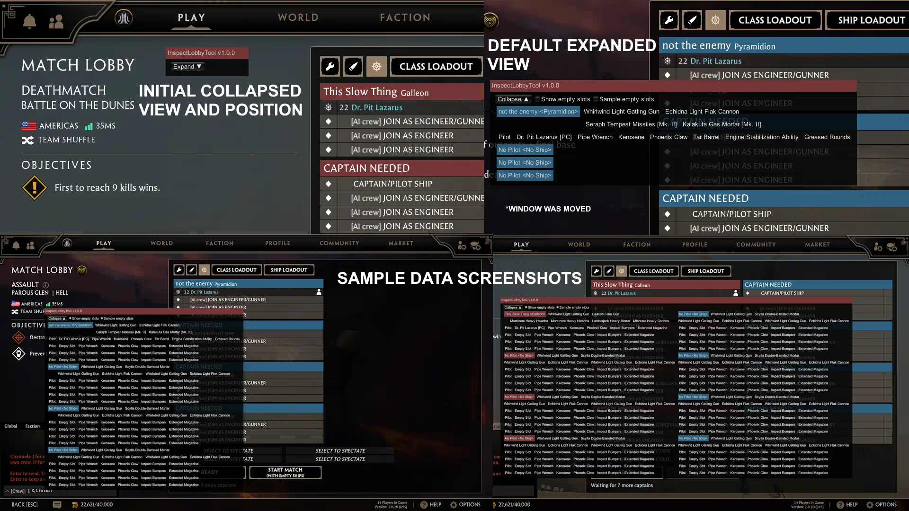

# InspectLobbyTool

| [Release Page](https://github.com/DrPitLazarus/goi-mods/releases/tag/InspectLobbyTool) | [Download](https://github.com/DrPitLazarus/goi-mods/releases/download/InspectLobbyTool/drpitlazarus.InspectLobbyTool.dll) | [Directions](/readme.md) |
|-|-|-|

A quality of life mod for the game Guns of Icarus Online/Alliance.

A draggable window appears on the match lobby screen that you can expand to inspect all ships and players equipped items.

The UI isn't pretty and not space efficient, but it's my first mod that does more than deleting a few lines of code. Yes, I'm aware there's a mod that does this better, but I was not aware of it nor looks to be freely available.

