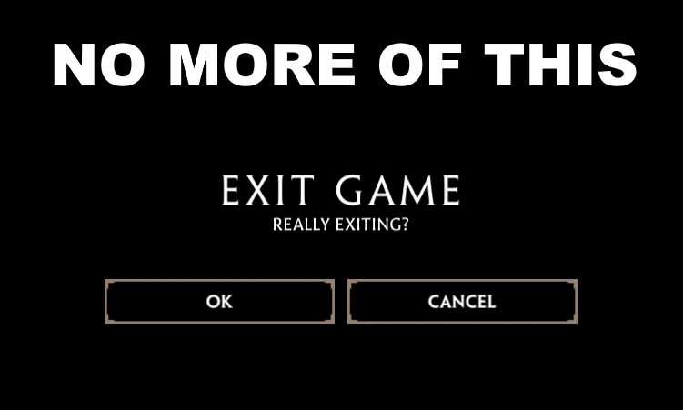

# SkipConfirmExitGame

| [Release Page](https://github.com/DrPitLazarus/goi-mods/releases/tag/SkipConfirmExitGame) | [Download](https://github.com/DrPitLazarus/goi-mods/releases/download/SkipConfirmExitGame/drpitlazarus.SkipConfirmExitGame.dll) | [Directions](/readme.md) |
|-|-|-|

A quality of life mod for the game Guns of Icarus Online/Alliance.

Removes the confirm screen when clicking the exit button on the connecting screen and main menu.

The exit button while in a match still has the confirm screen.

